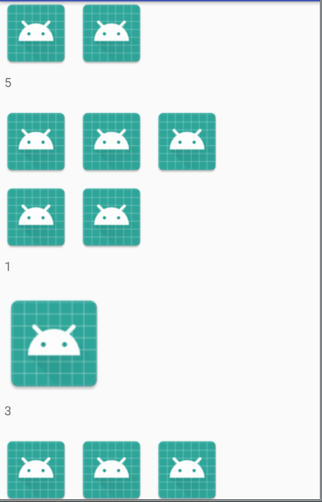

# RecycleViewWithMultGridImage
---
需求：
显示不同图标需要显示不同的行数和大小。




使用recycleView 的getVIewType 使不同的逻辑使用不同的viewHolder


```
 /**
     * @param position
     * @return
     */
    @Override
    public int getItemViewType(int position) {
        ImageBean imageBean = data.get(position);
        if (imageBean.images == null) {
            return 1;
        } else if (imageBean.images.size() == 1) {
            return 2;
        } else if (imageBean.images.size() == 4 || imageBean.images.size() == 7) {
            return 3;
        } else {
            return 4;
        }
    }

```

然后动态计算每个item的宽和高。